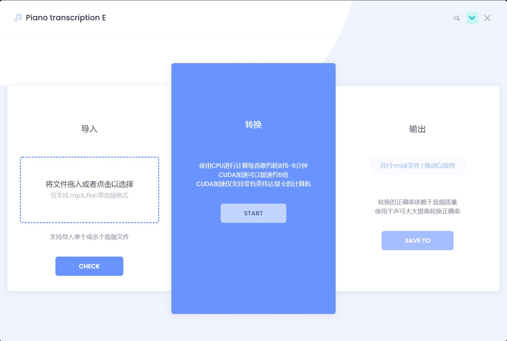

# Electron Python


## 项目最终效果展示

## 概览
为方便使用开源项目[piano_transcription](https://github.com/bytedance/piano_transcription)而创建，原项目可将钢琴音频通过机器学习模型转化为MIDI文件乐谱(.mid)，原项目每次操作均需要通过命令行输入欲转换的音频文件地址，该GUI可将所有操作为简单的chlick&drag。
## 结构
```
start
 |
 V
+--------------------+
|                    | start
|  electron          +-------------> +------------------+
|                    | sub process   |                  |
| (browser or)       |               | python server    |
|  desktop app       |               |                  |
| (all html/css/js)  |               | (business logic) |
|                    |    thrift     |                  |
| (node.js runtime,  | <-----------> | (thrift server)  |
|  thrift client)    | communication |                  |
|                    |               |                  |
+--------------------+               +------------------+
```
electron负责前台，不含任何业务逻辑，在main.js中创建python子线程，python子线程被创建后作为一个client监听转换任务，并调用相关的转换业务，二者通过[Apache Thrift](https://github.com/apache/thrift)进行通信。
## 运行效果


## main.js
main.js为程序入口和主线程，负责建立窗口和处理来自渲染线程的窗口操作消息，两个线程通过ipc进行通信。
```javascript
const {app, BrowserWindow, Notification, dialog} = require('electron')

  // Keep a global reference of the window object, if you don't, the window will
  // be closed automatically when the JavaScript object is garbage collected.
  let win

  function createWindow () {
    // 创建浏览器窗口。
    win = new BrowserWindow({
      width: 1000, 
      height: 800, 
      webPreferences:{nodeIntegration:true},
      transparent: true,
      frame: false,
      resizable:false,
      // backgroundColor: '#00000000',
    })

    // 然后加载应用的 index.html。
    win.loadFile('new_index.html')

    // 打开开发者工具
    // win.webContents.openDevTools()

    // 当 window 被关闭，这个事件会被触发。
    win.on('closed', () => {
      // 取消引用 window 对象，如果你的应用支持多窗口的话，
      // 通常会把多个 window 对象存放在一个数组里面，
      // 与此同时，你应该删除相应的元素。
      win = null
    })
  }

  // Electron 会在初始化后并准备
  // 创建浏览器窗口时，调用这个函数。
  // 部分 API 在 ready 事件触发后才能使用。
  app.on('ready', createWindow)

  // 当全部窗口关闭时退出。
  app.on('window-all-closed', () => {
    // 在 macOS 上，除非用户用 Cmd + Q 确定地退出，
    // 否则绝大部分应用及其菜单栏会保持激活。
    if (process.platform !== 'darwin') {
      app.quit()
    }
  })

  app.on('activate', () => {
    // 在macOS上，当单击dock图标并且没有其他窗口打开时，
    // 通常在应用程序中重新创建一个窗口。
    if (win === null) {
      createWindow()
    }
  })

  // 在这个文件中，可以续写应用剩下主进程代码。
  // 也可以拆分成几个文件，然后用 require 导入。

const path=require('path')
let pyProc = null
let pyPort = null


const createPyProc = () => {
  // let port = '4242'
  let script = path.join(__dirname, 'py', 'thrift_server.py')
  pyProc = require('child_process').spawn('python', [script])
  // let script = path.join(__dirname, 'py', 'dist','thrift_server', 'thrift_server.exe')
  // pyProc = require('child_process').execFile(script)
  if (pyProc != null) {
    console.log('child process success')
  }
}


const exitPyProc = () => {
  pyProc.kill()
  pyProc = null
  pyPort = null
}

let ipcMain = require('electron').ipcMain;
//接收最小化命令
ipcMain.on('window-min', function() {
    win.minimize();
})
//接收最大化命令
ipcMain.on('window-max', function() {
    if (win.isMaximized()) {
        win.restore();
    } else {
        win.maximize();
    }
})
//接收关闭命令
ipcMain.on('window-close', function() {
    win.close();
})

//拖动保存文件
ipcMain.on('ondragstart', (event, filePath) => {
  event.sender.startDrag({
    file: filePath,
    icon: './icon.png'
  })
})

//显示通知
function showNotification (){
  const notification = {
    title: 'Piano transcription E',
    body: '转换任务已完成'
  }
  new Notification(notification).show()
}
ipcMain.on('showNotification', function() {
  showNotification();
})

//接收打开对话框事件，完成后，回传获取到的文件路径到渲染线程
ipcMain.on('openDialog',(event, arg) => {
  dialog.showOpenDialog({ properties: ['openFile', 'multiSelections'] }).then(result=>{
      console.log(result.filePaths);        //输出结果
      if (result.filePaths.length>0) {
        event.reply('selectedItem', result.filePaths)
      }
    })
  })

//设置应用启动关闭时联动python子线程
app.on('ready', createPyProc)
app.on('will-quit', exitPyProc)
```
## render.js 
render线程作为页面逻辑元素被加载，负责建立thrift子线程，与子线程通信，并相应鼠标点击事件转换为事件信息传入主线程以控制桌面应用下的窗口。
```javascript
// renderer.js
var thrift = require('thrift');
// 调用win10下thrift命令自动生成的依赖包
var TranscriptionService = require('./gen-nodejs/TranscriptionService.js');
var ttypes = require('./gen-nodejs/trans_types.js');
// thrift 通信会占用一个本地端口
var thriftConnection = thrift.createConnection('127.0.0.1', 8000);
var thriftClient = thrift.createClient(TranscriptionService,thriftConnection);
var fs = require('fs');

//建立thrift子线程
thriftConnection.on("error",function(e)
{
    console.log(e);
});

// let name = document.querySelector('#name')
// let result = document.querySelector('#result')

let ipcRenderer = require('electron').ipcRenderer;

//响应点击最大化按钮
var max = document.getElementById('max');
if (max) {
    max.addEventListener('click', () => {
        //发送最大化命令
        ipcRenderer.send('window-max');
        //最大化图形切换
        if (max.getAttribute('src') == 'images/max.png') {
            max.setAttribute('src', 'images/maxed.png');
        } else {
            max.setAttribute('src', 'images/max.png');
        }
    })
}

//响应点击最小化按钮
var min = document.getElementById('min');
if (min) {
    min.addEventListener('click', () => {
        //发送最小化命令
        ipcRenderer.send('window-min');
    })
}

//响应点击关闭按钮
var close = document.getElementById('close');
if (close) {
    close.addEventListener('click', () => {
        //发送关闭命令
        ipcRenderer.send('window-close');
    })
}

//拖动保存文件
document.getElementById('drag_save').ondragstart = (event) => {
    event.preventDefault()
    ipcRenderer.send('ondragstart', dragTosavePath)
}

//响应点击开始转换按钮
var dragTosavePath = 'C:/Development/Projects/piano_transcription/output/test.mid'
var transcript = document.getElementById("transcript");
    if (transcript) {
        transcript.addEventListener('click', () => {
            // document.getElementById("progressDiv").innerHTML='<div class="progress-bar progress-bar-striped progress-bar-animated bg-primary" role="progressbar" style="width: 100% ;height: 20px;" aria-valuenow="25" aria-valuemin="0" aria-valuemax="100"></div>'
            // document.getElementById("progressDiv").setAttribute("hidden",true);
            document.getElementById("progressDiv").removeAttribute("hidden")
            document.getElementById("transcript").classList.add("disabled")
            document.getElementById("transcript").innerHTML = "processing..."
            var dic = {paths: filePaths}
            dic = JSON.stringify(dic)
            thriftClient.music2mid(dic, (error, res) => {
                if(error) {
                    console.error(error)
                } else {
                    Swal.fire("完成!", "您的所有转换任务已完成!", "success");
                    ipcRenderer.send('showNotification');
                    document.getElementById("transcript").classList.remove("disabled")
                    document.getElementById("transcript").innerHTML = "start"
                    document.getElementById("progressDiv").setAttribute("hidden",true)
                    document.getElementById("drag_save").removeAttribute("hidden")
                    midPaths = JSON.parse(res)['output_paths']
                    dragTosavePath = midPaths[0]
                    console.log(dragTosavePath)
                }
            })
            
        })
    };

//响应点击以打开文件
function openDialog(){
    ipcRenderer.send('openDialog');
};

ipcRenderer.on('selectedItem', (event, paths)=>{
    // console.log('render:');
    // console.log(paths);
    fileNum += paths.length;
    filePaths = filePaths.concat(paths)
    refreshFileNum()
});

var clickOpen = document.getElementById('drag_open');
if (clickOpen) {
    clickOpen.addEventListener('click', () => {
        openDialog()
    })
};

//拖拽打开功能
const dragWrapper = document.getElementById("drag_open");
//添加拖拽事件监听器
dragWrapper.addEventListener("drop", (e) => {
    //阻止默认行为
    e.preventDefault();
    //获取文件列表
    const files = e.dataTransfer.files;
    var paths = new Array();
    for (let file of files){
        //获取文件路径
        paths.push(file.path) 
    }
    // console.log(paths);
    fileNum += paths.length;
    filePaths = filePaths.concat(paths)
    refreshFileNum();
});

//阻止拖拽结束事件默认行为
dragWrapper.addEventListener("dragover", (e) => {
    e.preventDefault();
});

var fileNum = 0;
var filePaths = new Array();
const fileNumLabel = document.getElementById("fileNumLabel");
const fileList = document.getElementById("fileList");
function refreshFileNum(){
    fileNumLabel.innerHTML='已选择'+fileNum+'个文件'
    fileList.innerHTML='<span>支持导入单个或多个音频文件</span>'
    for (let file of filePaths){
        let arr =  file.split("\\")
        let fileSpan = document.createElement('span')
        fileSpan.innerHTML = arr[arr.length-1]
        fileList.appendChild(fileSpan)
    };
    
};

var clickOpen = document.getElementById('check');
if (clickOpen) {
    clickOpen.addEventListener('click', () => {
        document.getElementById("transcript").classList.remove("disabled")
        console.log(fileNum, filePaths)
    })
};
```
## thrift.py
thrift.py负责处理业务逻辑部分，并创建thrift服务端，相应转换指令，需要注意的是，前台传入的仅为欲转换音频文件的路径，python完成转换后传回生成的mid文件路径。
```python
import json
from thrift.transport import TSocket
from thrift.transport import TTransport
from thrift.protocol import TBinaryProtocol
from thrift.server import TServer

from gen_py.trans import TranscriptionService

from piano_transcription_inference import PianoTranscription, sample_rate, load_audio
import os

checkpoint_path = 'py/piano_transcription_inference_data/note_F1=0.9677_pedal_F1=0.9186.pth'
class Transcription:
    def music2mid(self, dic):
        output_files_list = []
        print(dic)
        def mp32mid(fp):
            # Load audio
            (audio, _) = load_audio(fp, sr=sample_rate, mono=True)
            print('loaded')
            # Transcriptor
            transcriptor = PianoTranscription(device='cuda', checkpoint_path=checkpoint_path)  # 'cuda' | 'cpu'
            fname=fp.split('\\')[-1]
            print(fname+' is processing...')
            # Transcribe and write out to MIDI file
            output_file = os.getcwd()+'\\py\\output\\' + fname + '.mid'
            transcribed_dict = transcriptor.transcribe(audio, output_file)  # 设置输出路径（文件名）
            return output_file

        dic = json.loads(dic)
        for path in dic["paths"]:
            output_files_list.append(mp32mid(path))
        res = json.dumps({"output_paths":output_files_list})
        return res

        return f'{res}'


if __name__ == "__main__":
    port = 8000
    ip = "127.0.0.1"
    # 创建服务端
    handler = Transcription()  # 自定义类
    processor = TranscriptionService.Processor(handler)  # userService为python接口文件自动生成
    # 监听端口
    transport = TSocket.TServerSocket(ip, port)  # ip与port位置不可交换
    # 选择传输层
    tfactory = TTransport.TBufferedTransportFactory()
    # 选择传输协议
    pfactory = TBinaryProtocol.TBinaryProtocolFactory()
    # 创建服务端
    server = TServer.TThreadedServer(processor, transport, tfactory, pfactory)
    print("start server in python")
    server.serve()
    print("Done")

```
## thrift接口文件的生成
由于thrift接口连接两种语言，所以需要对接口进行定义
## trans.thrift
```
service TranscriptionService {
    string music2mid(1:string name)
}
```
然后使用
```shell
thrift.exe -out ./gen_py -gen py  trans.thrift
'''
./gen_py
│__init__.py
│
└trans
   │  constants.py
   │  TranscriptionService-remote
   │  TranscriptionService.py
   │  ttypes.py
   └  __init__.py
'''
thrift.exe -out ./gen_nodejs --gen js:node  trans.thrift
'''
./gen_nodejs
├─TranscriptionService.js
└─trans_types.js
```
生成对应语言的接口程序供调用
Python中的调用：
```shell
from thrift.transport import TSocket
from thrift.transport import TTransport
from thrift.protocol import TBinaryProtocol
from thrift.server import TServer
```
Electron(node.js)中的调用：
JavaScript中的调用：
```javascript
var thrift = require('thrift');
// 调用win10下thrift命令自动生成的依赖包
var TranscriptionService = require('./gen-nodejs/TranscriptionService.js');
var ttypes = require('./gen-nodejs/trans_types.js');
// thrift 通信会占用一个本地端口
var thriftConnection = thrift.createConnection('127.0.0.1', 8000);
var thriftClient = thrift.createClient(TranscriptionService,thriftConnection);
```


