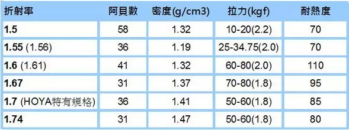

# 眼镜新鸟的经验谈

### 前言
19年4月19日，陪伴我多年的变色眼镜终于光荣退役了，在镜框的纵容下，左眼镜片选择结束自己的使命奔向了自由。

这是我的第三副眼镜，当时心血来潮选择的变色片，变色片虽然用着舒服，但是因为如下原因不太想用第二次：

1. 镜片变色取决于紫外线强度，所以，开车没用（挡风玻璃有过滤紫外线作用），下雨天或者阴天却有可能变色，你能想到在一个阴郁的傍晚看一个戴墨镜的人有多傻叼吗？
2. 墨镜自带一丢丢的装逼属性，虽然很多时候都是为了眼睛舒服，别人觉得装逼就装吧，反正戴上墨镜别人认不出（还可以遮挡视线看可爱的小姐姐），但是，变色片不一样，它会变色，但是却不会像墨镜那样黑，别人还是能看见你，认出你（还挡不了视线）。所以你有时会看到走在路上别人会看你，毕竟变色片还不是特别主流。
3. 变色片恢复时间还是比较长，突然从阳光下进入室内会很不适应，相当于室内戴墨镜你还没法取，而且如果在眼镜还是半黑的情况下去见长辈或者老师感觉很不礼貌
 
变色片就当是个玩具，如果有长时间的室外工作需求还是可以弄一副，比墨镜还是方便一点，虽然没有墨镜帅。
 
高度近视患者没有备用镜，简直生活都没办法自理，虽然我还有一个争气的右眼200度能撑一下，之前一直觉得眼镜是个暴利行业，一副普普通通的框一堆名词忽悠来就敢买一两千，毛利率甚至超过95%，但是看了一个“挺着暴利光环挣扎在温饱线上的眼镜店主”写的帖子，对这个行业有了不一样的看法，眼镜确实是单品利率高，但是店铺利率低，为什么？卖的少啊，眼镜又不像手机，隔一两年还搞个更新换代，如果不是出什么问题或者度数猛涨，一般人戴个十年八年没有任何问题，很多店撑死两三天卖一副，水电气加房租一减，维持温饱还是很轻松，真不是别人想坑你钱，实在是运营模式下没办法。
 
有人一听好耳熟，水电房租这好办，网购啊，网店不就是摆脱了这些固定成本吗？其实尝试的人还真不少，国内几家大牌都有网上商城，但是眼镜作为一个定制化程度极高的产品，在网购中处处水土不服。验光问题--要去医院，选框问题--好吧别人寄几幅您挑，挑好了还得给别人退回去，然后都选妥了别人再工厂生产完给您寄过去，一来二去大半个月就没了，我还不如直接去街上找家眼镜店呢。
 
这次配镜和以前不一样，大学里终于有充足的时间去配一副眼镜了，不像以前老妈带着，火速完事儿。在网上查资料做了很多功课，算是小有心得，在这里做个分享记录。
 
### “快时尚品牌”？

眼镜行业发展到现在，还有突破的可能吗？
 
还真有，既然实体店面临成本高风险等压力，还是可以沿用互联网那一套，定位年轻市场，重设计，打造网红体验，走量来保证利率。所以一批“快时尚”品牌迅速兴起，以"快、狠、准"为主要特征，换成直接体验就是店铺的装修时尚气息浓厚、购物氛围自由、服务贴心；其次，产品时尚潮流度较高，更新速度快，同时价格亲民，不会像普通眼镜店那样一直有一个店员跟着你碎碎念（社恐噩梦），镜架不会锁在玻璃柜子里而是摆在货架上可以随意试戴，有需要店员也会给你一些建议，体验好了不少。目前国内比较火的快时尚品牌有JINS(睛姿)、LOHO眼镜生活、木九十、ZOFF(佐芙)、Aojo(艾镜)、EXE镜自由、eGG、URAKU(乐顾)、Zele、LookOptical等。
 
在小红书和什么值得买上，Jins可以说是众人的心头好，具体购买帖自己去搜，不在累述。定位年轻和高性价比的标签深得我心，所以就选它家的眼镜了，先是打算网购，但是没有办法试戴让我这个脸形不好撘的人知难而退。一搜发现成都的店面还真不太少，大概有七八家，选了从图片上看店面最大的环球中心店。
 
环球中心巨无霸的体积着实让我这个处于半失明状态的人找了好一阵，到了店门口就发现和外面那些妖艳贱货果然不一样，和周围的时装大牌完美融为一体，温馨的装修和开放的镜架让一些不打算配镜的人都有进去逛逛的冲动。
 
最后在店员小姐姐的推荐下选了一个999的钛框，考虑到左眼500的度数,加300元上了1.67，搞活动再优惠一百，到手价1199.由于需要定制镜片，5-7天后才能取镜或者邮寄，开箱图待补
 
下面是重点，在近几年一些媒体的刻意引导下，消费者和商家之间的信息不对等被刻意放大，很多人都觉得“商家的嘴，骗人的鬼”，当然一些无良商家也对造成这样的局面功不可没，我还是相信世界上还是好人多，有些商家还是会很贴心地帮你选择商品的，如果你还是觉得不太保险，那么最好的办法就是消除问题的根源--信息不平等，如果你能够分辨出商家嘴里每个晦涩难懂的词语的意思，那再没人能够骗到你。
 
### 1.56? 1.60? 1.67？

眼镜是通过折射改变入射光线，从而使外界的光线能够在视网膜上清晰成像，以达到矫正视力的目的。每人需要矫正的程度，或者说近视（远视）的度数不一样，通过改变镜片的形状或者折射率就可以实现不同的矫正度数。而商家在选择镜片时所说的1.56\1.67就是指的镜片折射率，一般来说，折射率越高，镜片就越薄，随之重量下降和美观度也会提升。但对于低度数的同学来说，不同折射率之间的镜片薄厚差距微乎其微，而价格之间的差距就比较大了。高折射率的优势只有在高倍镜中才能体现出来。
 
1、100度以下的近视或平光，或者100度以下的远视，建议选择1.50折射率的镜片；

2、100~300度的近视，或者100~300度以下的远视，建议选择1.56折射率的镜片；

3、300~600度的近视，或者300度~600度以下的远视，建议选择1.60折射率的镜片；

4、600~800度的近视，建议选择1.67折射率的镜片；

5、800度以上的近视，建议选择1.74折射率的镜片。
 
### 阿贝数？

可能有的同学会想，我有钱，任性，虽然我度数不高，但是我就要选最贵的1.74折射率，那减少的零点几克重量对本仙女很重要。这样选择并不理智，这就涉及到一个商家往往不会告诉你的参数--阿贝数（色散系数）。
 
先来复习一下高中物理---同种介质对不同波长的光有不同的折射率。通过这个原理，我们可以造出三棱镜，将不同波长的光分开，衡量这种能力的指标就是阿贝数，色散现象在眼镜中同样存在，一些高度近视的朋友在通过眼镜边缘看物体时有时会发现物体边缘有蓝边，这就是发生了色散。色散程度越低，成像的效果越好，不同折射率的眼镜阿贝数参考如下

 
总体来说，1.50折射率的镜片的阿贝数可以达到58，但是一旦用到1.74折射率超超薄以上等级的镜片时，阿贝数会下降到32~36。所以，有好就有坏。如果一味追求镜片的薄，那么就会牺牲镜片的阿贝数，也就是降低了视觉对于颜色的真实感受，以及舒适度。
